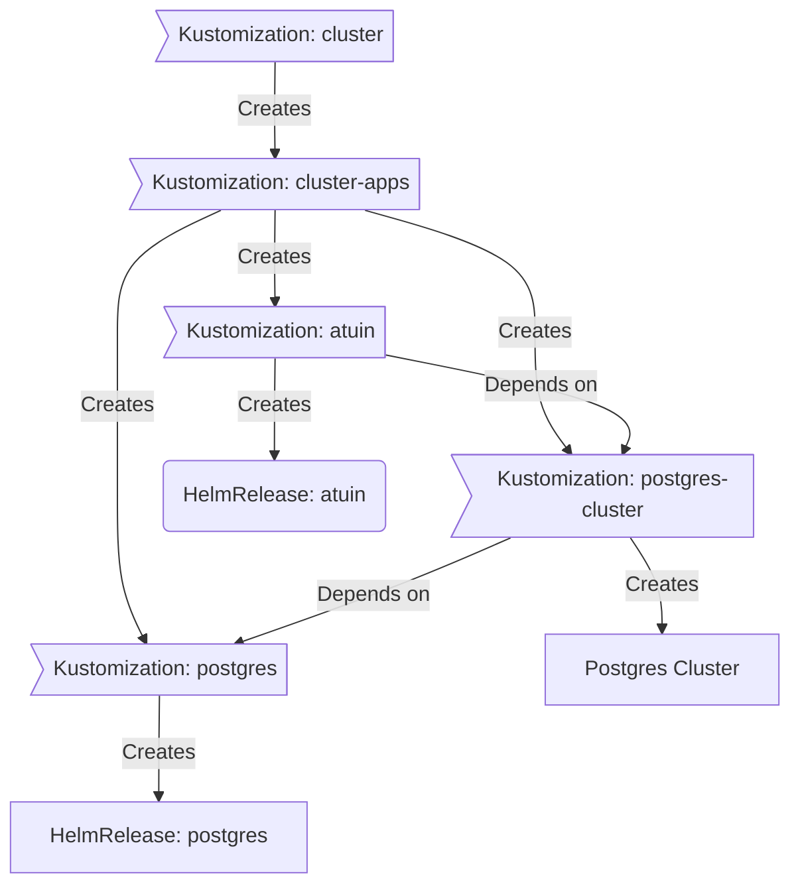

# Homelab Kubernetes Cluster

[](https://www.talos.dev/)
[](https://kubernetes.io/)

This repository contains the GitOps configuration for my homelab Kubernetes cluster. It's powered by [Flux](https://fluxcd.io/) and [Talos Linux](https://www.talos.dev/)

## 🛠 Core Components

- [Talos Linux](https://www.talos.dev/): Immutable K8s-focussed operating system.
- [Flux](https://fluxcd.io/): GitOps.
- [actions-runner-controller](https://github.com/actions/actions-runner-controller): Self-hosted Github runners.
- [cert-manager](https://github.com/cert-manager/cert-manager): Creates SSL certificates for services in my cluster.
- [cilium](https://github.com/cilium/cilium): Internal Kubernetes container networking interface.
- [cloudflared](https://github.com/cloudflare/cloudflared): Enables Cloudflare secure access to certain ingresses.
- [external-dns](https://github.com/kubernetes-sigs/external-dns): Automatically syncs ingress DNS records to a DNS provider.
- [external-secrets](https://github.com/external-secrets/external-secrets): Managed Kubernetes secrets using [1Password Connect](https://github.com/1Password/connect).
- [ingress-nginx](https://github.com/kubernetes/ingress-nginx): Kubernetes ingress controller using NGINX as a reverse proxy and load balancer.
- [rook](https://github.com/rook/rook): Distributed block storage for peristent storage.
- [sops](https://github.com/getsops/sops): Managed secrets for Kubernetes and Terraform which are commited to Git.
- [spegel](https://github.com/spegel-org/spegel): Stateless cluster local OCI registry mirror.
- [volsync](https://github.com/backube/volsync): Backup and recovery of persistent volume claims.

## How the cluster works
### GitOps

[Flux](https://github.com/fluxcd/flux2) watches the clusters in my [kubernetes](./kubernetes/) folder (see Directories below) and makes the changes to the cluster based on the state of this Git repository.

The way Flux works for me here is it will recursively search the `kubernetes/${cluster}/apps` folder until it finds the most top level `kustomization.yaml` per directory and then apply all the resources listed in it. That aforementioned `kustomization.yaml` will generally only have a namespace resource and one or many Flux kustomizations (`ks.yaml`). Under the control of those Flux kustomizations there will be a `HelmRelease` or other resources related to the application which will be applied.

[Renovate](https://github.com/renovatebot/renovate) watches my **entire** repository looking for dependency updates, when they are found a PR is automatically created. When some PRs are merged Flux applies the changes to my cluster.

### 📂 Directories

```
📁 .taskfiles           # Task files for various operations
📁 kubernetes           # Main Kubernetes configurations
└─📁 main               # Main cluster configurations
  ├─📁 apps             # Application deployments
  ├─📁 bootstrap        # Cluster bootstrap configurations
  ├─📁 flux             # Flux system configurations
  └─📁 templates        # Templates for volsync and gatus
```

### Flux Workflow

This is a high-level look how Flux deploys my applications with dependencies. Below there are 3 Flux kustomizations `postgres`, `postgres-cluster`, and `atuin`. `postgres` is the first app that needs to be running and healthy before `postgres-cluster` and once `postgres-cluster` is healthy `atuin` will be deployed.



## 🤝 Acknowledgements

This project is inspired by the [Home Operations](https://discord.gg/home-operations) Discord community and the [flux-cluster-template](https://github.com/onedr0p/flux-cluster-template). Have a look at [kubesearch.dev](https://kubesearch.dev/) to see how other people are deploying things!
