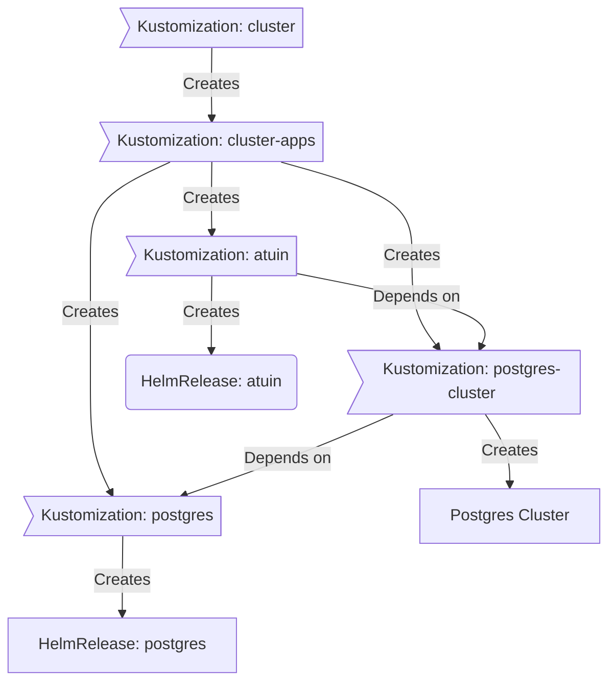

# Homelab Kubernetes Cluster

[](https://www.talos.dev/)
[](https://kubernetes.io/)

This repository contains the GitOps configuration for my homelab Kubernetes cluster. It's powered by [Flux](https://fluxcd.io/) and [Talos Linux](https://www.talos.dev/)

## 🛠 Core Components

- [Talos Linux](https://www.talos.dev/): Immutable K8s-focussed operating system.
- [Flux](https://fluxcd.io/): GitOps.
- [actions-runner-controller](https://github.com/actions/actions-runner-controller): Self-hosted Github runners.
- [cert-manager](https://github.com/cert-manager/cert-manager): Creates SSL certificates for services in my cluster.
- [cilium](https://github.com/cilium/cilium): Internal Kubernetes container networking interface.
- [cloudflared](https://github.com/cloudflare/cloudflared): Enables Cloudflare secure access to certain ingresses.
- [external-dns](https://github.com/kubernetes-sigs/external-dns): Automatically syncs ingress DNS records to a DNS provider.
- [external-secrets](https://github.com/external-secrets/external-secrets): Managed Kubernetes secrets using [1Password Connect](https://github.com/1Password/connect).
- [ingress-nginx](https://github.com/kubernetes/ingress-nginx): Kubernetes ingress controller using NGINX as a reverse proxy and load balancer.
- [rook](https://github.com/rook/rook): Retired Ceph storage; no longer deployed or used as a provisioner.
- [sops](https://github.com/getsops/sops): Managed secrets for Kubernetes and Terraform which are commited to Git.
- [spegel](https://github.com/spegel-org/spegel): Stateless cluster local OCI registry mirror.
- [Synology CSI](https://github.com/SynologyOpenSource/synology-csi): Primary persistent storage on Synology iSCSI.
- [volsync](https://github.com/backube/volsync): Backup and recovery of persistent volume claims.

## How the cluster works

### Storage

The default StorageClass is `synology-iscsi` (Retain). Existing Prometheus history
remains on `openebs-hostpath`; its claim template explicitly preserves that backend.
VolSync defaults to `synology-iscsi-ephemeral` (Delete) for movers, `synology-iscsi`
snapshots, and `synology-nfs-cache` metadata caches, with independent MinIO and R2
backup repositories. Existing application overrides remain in place.
Recovery destinations keep their staging volumes: Synology snapshots depend on
the source LUN and are deleted with it. Do not reclaim active recovery staging.
Rook/Ceph is retired from the desired state and no longer provisions storage.
The verified MinIO/R2 backups are the accepted recovery path for any residual
Ceph-backed data; retirement does not require reclaiming individual old RBD
images or wiping the underlying SSDs.
Residual Ceph disk data is not a supported rollback, and disks must be prepared
separately before reuse. Do not remove active Synology storage or recovery
stages.

### Node networking

The former Ceph-only `172.20.0.0/24` node addresses are removed. Management,
the API VIP and NAS connectivity remain on `10.0.16.0/24`.

### GitOps

[Flux](https://github.com/fluxcd/flux2) watches the clusters in my [kubernetes](./kubernetes/) folder (see Directories below) and makes the changes to the cluster based on the state of this Git repository.

The way Flux works for me here is it will recursively search the `kubernetes/${cluster}/apps` folder until it finds the most top level `kustomization.yaml` per directory and then apply all the resources listed in it. That aforementioned `kustomization.yaml` will generally only have a namespace resource and one or many Flux kustomizations (`ks.yaml`). Under the control of those Flux kustomizations there will be a `HelmRelease` or other resources related to the application which will be applied.

[Renovate](https://github.com/renovatebot/renovate) watches my **entire** repository looking for dependency updates, when they are found a PR is automatically created. When some PRs are merged Flux applies the changes to my cluster.

### 📂 Directories

```
📁 .taskfiles           # Task files for various operations
📁 kubernetes           # Main Kubernetes configurations
└─📁 main               # Main cluster configurations
  ├─📁 apps             # Application deployments
  ├─📁 bootstrap        # Cluster bootstrap configurations
  ├─📁 flux             # Flux system configurations
  └─📁 templates        # Templates for volsync and gatus
```

### Flux Workflow

This is a high-level look how Flux deploys my applications with dependencies. Below there are 3 Flux kustomizations `postgres`, `postgres-cluster`, and `atuin`. `postgres` is the first app that needs to be running and healthy before `postgres-cluster` and once `postgres-cluster` is healthy `atuin` will be deployed.


```mermaid
graph TD;
  id1>Kustomization: cluster] -->|Creates| id2>Kustomization: cluster-apps];
  id2>Kustomization: cluster-apps] -->|Creates| id3>Kustomization: postgres];
  id2>Kustomization: cluster-apps] -->|Creates| id5>Kustomization: postgres-cluster]
  id2>Kustomization: cluster-apps] -->|Creates| id8>Kustomization: atuin]
  id3>Kustomization: postgres] -->|Creates| id4[HelmRelease: postgres];
  id5>Kustomization: postgres-cluster] -->|Depends on| id3>Kustomization: postgres];
  id5>Kustomization: postgres-cluster] -->|Creates| id10[Postgres Cluster];
  id8>Kustomization: atuin] -->|Creates| id9(HelmRelease: atuin);
  id8>Kustomization: atuin] -->|Depends on| id5>Kustomization: postgres-cluster];
```

## 🤝 Acknowledgements

This project is inspired by the [Home Operations](https://discord.gg/home-operations) Discord community and the [flux-cluster-template](https://github.com/onedr0p/flux-cluster-template). Have a look at [kubesearch.dev](https://kubesearch.dev/) to see how other people are deploying things!
